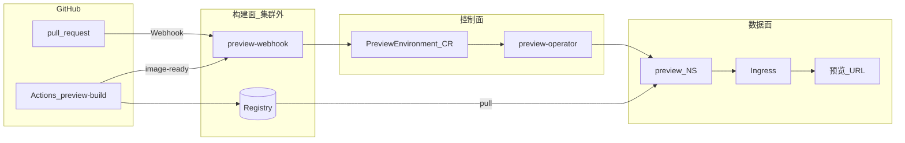
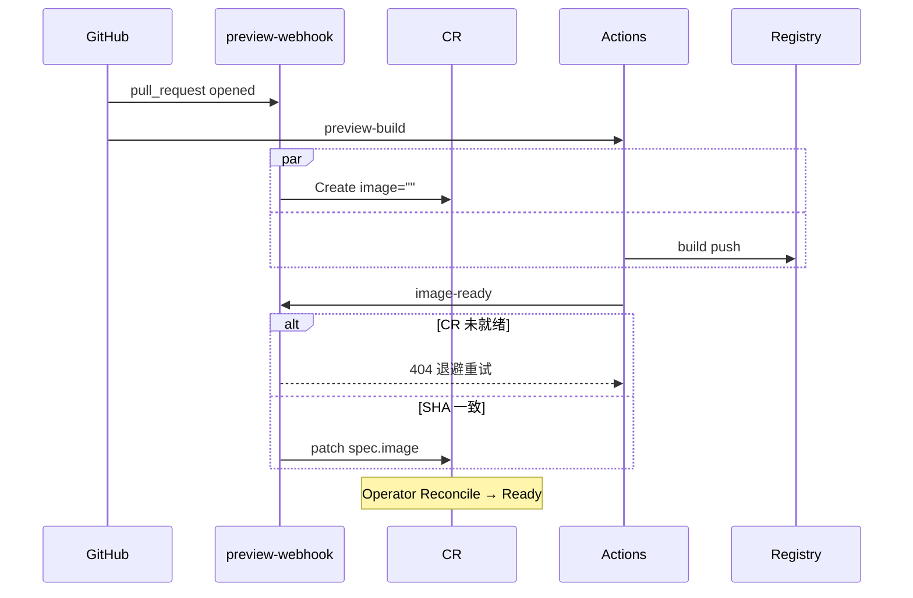
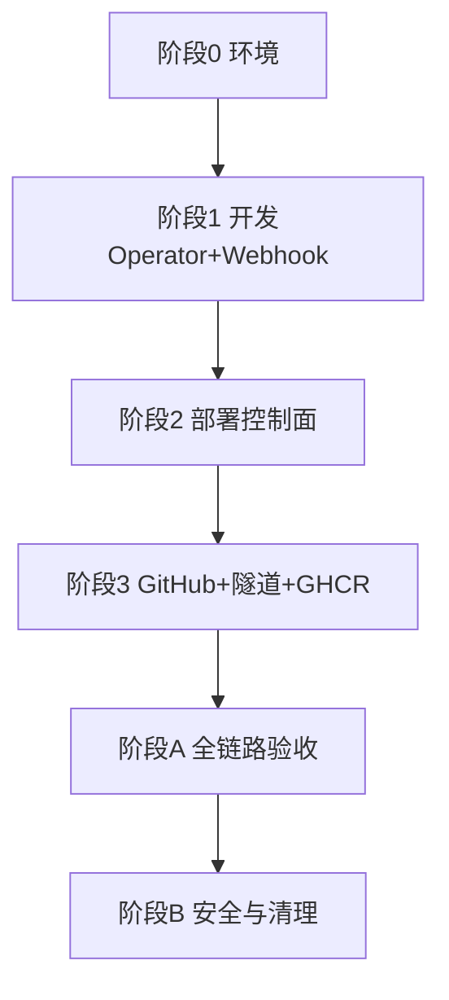
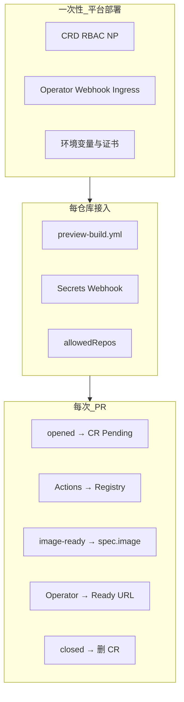

# PR 预览平台 — 完整流程

> 本文档整合 [项目评审方案](项目评审方案.md)、[镜像构建](镜像构建方案.md)、[Operator 设计](operator-go设计.md) 与 [Minikube 预案](minikube实现预案.md)，给出 **端到端可执行流程**。  
> **镜像构建统一使用 GitHub Actions**（业务仓 `.github/workflows/preview-build.yml`），不在集群内构建、不使用其他 CI 替代方案。

---

## 1. 总览

### 1.1 目标

GitHub PR 打开后自动获得独立预览 URL；关闭 PR 后约 2 分钟内回收资源。控制面在集群内，构建面在集群外（GitHub Actions + Registry）。

### 1.2 架构



### 1.3 双通路（所有环境一致）

| 通路 | 触发 | 入口 | 作用 |
| --- | --- | --- | --- |
| **① PR 生命周期** | `pull_request` opened / reopened / synchronize / closed | `POST /webhook/github` | 创建/更新/删除 CR；`synchronize` 时**清空 `spec.image`** |
| **② 镜像就绪** | Actions 构建并 push 成功后 | `POST /api/v1/preview/image-ready` | **仅** patch `spec.image` |

关 PR 只走路径 ①；路径 ② 不负责删资源。

### 1.4 组件职责

| 组件 | 职责 |
| --- | --- |
| **GitHub Actions** | checkout PR head → `docker build` → push Registry → 回调 `image-ready` |
| **preview-webhook** | 校验 HMAC / Bearer；CRUD `spec`；**不**写 `status`、**不**建 Deployment |
| **preview-operator** | Reconcile CR → `preview` NS 工作负载；Finalizer 清理；维护 `status` |
| **Registry** | 存储镜像；集群按 `spec.image` 拉取 |

### 1.5 安全底线（MUST）

1. 固定 Namespace `preview`，禁止「一 PR 一 NS」、禁止自动化 `delete namespace`。
2. 工作负载写权限仅 `Role@preview`；Webhook 仅 CR 权限。
3. 业务 CI **不得** `kubectl apply` 或直连集群。
4. Webhook 必须校验 `X-Hub-Signature-256`；`image-ready` 使用 Bearer Token + 仓库白名单。

### 1.6 CR 与镜像约定（摘要）

| 项 | 值 |
| --- | --- |
| GVK | `preview.platform.io/v1alpha1` / `PreviewEnvironment`（Cluster） |
| CR 名 | `{repo-slug}-pr-{n}` |
| Host | `pr-{n}-{repo-slug}.{PREVIEW_DOMAIN}` |
| 镜像 tag | `{REGISTRY}/{app}:pr-{n}-{shortSHA}`（shortSHA = head commit 前 7 位小写） |
| `status.phase` | `Pending` \| `Ready` \| `Failed` \| `Terminating`；`Ready` 需 ImageReady + DeploymentAvailable + IngressReady |

---

## 2. 镜像构建（GitHub Actions，共用）

以下流程在 **Minikube 与正式环境语义相同**，仅 `REGISTRY`、凭据与回调 URL 不同（见 §3 / §4 环境对照表）。

### 2.1 触发矩阵

| GitHub `pull_request` action | Actions workflow | 控制面 Webhook |
| --- | --- | --- |
| `opened` | **运行** | Create CR，`spec.image` 为空 |
| `reopened` | **运行** | Update CR |
| `synchronize` | **运行**（取消同 PR 旧 run） | 更新 `headSHA`，**清空 `spec.image`** |
| `closed` | **不运行** | Delete CR → Finalizer 清理 |

构建与 Webhook **并行**；`image-ready` 须在 CR 已存在后成功（竞态见 §2.5）。

### 2.2 业务仓 Workflow 契约

每个接入仓库 **必须** 包含 `.github/workflows/preview-build.yml`：

```yaml
on:
  pull_request:
    types: [opened, synchronize, reopened]

concurrency:
  group: preview-${{ github.repository }}-${{ github.event.pull_request.number }}
  cancel-in-progress: true
```

| 步骤 | 动作 | 失败时 |
| --- | --- | --- |
| 1 | `checkout` **PR head SHA**（非 merge commit） | workflow 失败，**不**回调 |
| 2 | 计算 `image` = `{REGISTRY}/{APP}:pr-{n}-{shortSHA}` | — |
| 3 | `docker login` + `build-push` | workflow 失败，**不**回调 |
| 4 | `POST /api/v1/preview/image-ready` | workflow 失败；CR 保持 `Pending` |

**模板**

- 正式：[templates/github-actions-snippet.yml](../templates/github-actions-snippet.yml)
- Minikube 演示：[demo/demo-repo/.github/workflows/preview-build.yml](../demo/demo-repo/.github/workflows/preview-build.yml)

### 2.3 image-ready 请求

| 项 | 值 |
| --- | --- |
| Method | `POST` |
| Path | `/api/v1/preview/image-ready` |
| Header | `Authorization: Bearer <PREVIEW_CALLBACK_TOKEN>` |

Body 示例：

```json
{
  "repoFullName": "myorg/myapp",
  "prNumber": 42,
  "headSHA": "a1b2c3d4e5f6789012345678abcdef012345678",
  "image": "registry.example.com/myapp:pr-42-a1b2c3d"
}
```

Webhook 处理：校验 Token → 白名单 → 查 CR → **`headSHA` 与 `spec.headSHA` 一致** → patch `spec.image` → 200/204。  
SHA 不一致 → **409**（旧构建回调）；CR 不存在 → **404**（CI 退避重试）。

### 2.4 CI 对 404 的退避（MUST）

**2s → 4s → 8s → 16s → 32s**；非 404（401/403/409/5xx）不得无限重试。

### 2.5 时序



### 2.6 业务仓接入清单（管理员）

| # | 配置项 | 位置 |
| --- | --- | --- |
| 1 | `preview-build.yml` | 业务仓 `.github/workflows/` |
| 2 | `Dockerfile`（默认仓库根，端口默认 8080） | 业务仓 |
| 3 | `PREVIEW_CALLBACK_URL` | 业务仓 Actions Secret |
| 4 | `PREVIEW_CALLBACK_TOKEN` | 业务仓 Secret（= 平台 `IMAGE_READY_TOKEN`） |
| 5 | Registry 推送凭据 | Secret 或 `GITHUB_TOKEN`（GHCR） |
| 6 | 仓库 Webhook | GitHub → `/webhook/github` |
| 7 | `allowedRepos` | 平台 Webhook 环境变量 |
| 8 | `imagePullSecret`（私有 Registry） | 集群 `preview` NS |

### 2.7 构建失败与平台状态

| 情况 | CR | 用户可见 |
| --- | --- | --- |
| build/push 失败 | `Pending`，无新 `image` | Actions 失败 |
| image-ready 耗尽重试 | `Pending` | Actions 失败 |
| 集群镜像拉取失败 | Operator → `Failed` | 预览 URL 不可用 |

平台**不**在首期触发重新构建；由开发者 `git push` 或 Re-run workflow。

---

## 3. Minikube 本地流程

> 目的：在单机验证与生产**同构**的控制面（双通路、RBAC、NP、Finalizer）。  
> 开发机参考 **macOS**（Docker Desktop + Homebrew）；其他 OS 替换等价工具即可。

### 3.1 与环境差异（相对正式）

| 项 | Minikube | 正式 |
| --- | --- | --- |
| 集群 | `minikube` + Ingress addon | 现网 K8s + NP CNI |
| Registry | `ghcr.io/<owner>` | 企业 Registry |
| Actions 推送 | `GITHUB_TOKEN` + `packages: write` | `REGISTRY_USER` / `REGISTRY_PASSWORD` 或 OIDC |
| Webhook 入口 | **ngrok** + `kubectl port-forward` | 固定 Ingress + TLS |
| 预览域 | `preview.local` + `/etc/hosts` | `PREVIEW_DOMAIN` 通配符 DNS/TLS |
| Operator 镜像 | 本地 build + `minikube image load` | 镜像仓库固定版本 |

### 3.2 流程总览



**原则**：上一阶段验收通过再进入下一阶段。

---

#### 阶段 0 — 环境准备

| 步骤 | 操作 | 完成标志 |
| --- | --- | --- |
| 0.1 | 安装 Docker Desktop、minikube、kubectl、ngrok、Go | 命令可用 |
| 0.2 | `minikube start --cpus=4 --memory=8192 --driver=docker` | 节点 Ready |
| 0.3 | `minikube addons enable ingress` | ingress-nginx Running |
| 0.4 | 终端保持 `sudo minikube tunnel` | 本机 80/443 可达 Ingress |
| 0.5 | `/etc/hosts` 增加 `pr-<n>-<repo-slug>.preview.local` → `127.0.0.1` | curl 可解析 |

---

#### 阶段 1 — 开发 Operator 与 Webhook

实现规范见 [operator-go设计.md](operator-go设计.md)。

| 组件 | 要点 | 产出 |
| --- | --- | --- |
| Operator | Reconcile、Finalizer、仅写 `preview` NS | `preview-operator:dev` + `minikube image load` |
| Webhook | `/webhook/github` + `/api/v1/preview/image-ready` | `preview-webhook:dev` + `minikube image load` |

**完成标志**：`make test` 通过；两镜像已载入 minikube。

---

#### 阶段 2 — 部署控制面

| 步骤 | 操作 |
| --- | --- |
| 2.1 | `kubectl apply -f templates/rbac-operator.yaml` |
| 2.2 | 安装 CRD（`templates/crd-previewenvironment.yaml` 或 `make install`） |
| 2.3 | `kubectl apply -f templates/operator-deployment.yaml`（`REGISTRY=ghcr.io/<owner>`） |
| 2.4 | 创建 Secret `preview-webhook-secrets`（`github-webhook-secret`、`image-ready-token`） |
| 2.5 | `kubectl apply -f templates/webhook-deployment.yaml` |

```bash
kubectl create secret generic preview-webhook-secrets -n preview-system \
  --from-literal=github-webhook-secret='<GitHub Webhook Secret>' \
  --from-literal=image-ready-token='<与 Actions PREVIEW_CALLBACK_TOKEN 一致>'
```

**完成标志**：`preview-system` 内 Operator、Webhook Pod 均为 Running。

---

#### 阶段 3 — GitHub 演示仓与公网回调

| 步骤 | 操作 |
| --- | --- |
| 3.1 | 将 [demo/demo-repo](../demo/demo-repo) 推到 `myorg/preview-demo` |
| 3.2 | Actions 开启 packages 读写（GHCR） |
| 3.3 | 仓库 Secrets：`PREVIEW_CALLBACK_URL`、`PREVIEW_CALLBACK_TOKEN` |
| 3.4 | `kubectl port-forward -n preview-system svc/preview-webhook 18080:8080` |
| 3.5 | `ngrok http 18080` → 得到 `https://xxxx.ngrok-free.app` |
| 3.6 | GitHub Webhook：`https://xxxx.ngrok-free.app/webhook/github`，事件 Pull requests |
| 3.7 | 更新 `PREVIEW_CALLBACK_URL` = ngrok 基址 + `/api/v1/preview/image-ready` |
| 3.8 | GHCR 若为 private：在 `preview` NS 配置 `imagePullSecret` |
| 3.9 | Webhook/Operator 环境变量：`ALLOWED_REPOS=myorg/preview-demo`，`REGISTRY=ghcr.io/<owner>` |

> ngrok 免费域名重启后会变，须同步更新 GitHub Webhook 与 Actions Secret。

**完成标志**：开测试 PR 后 Webhook Delivery 200，且集群出现对应 CR（`spec.image` 可能仍空，待 Actions 完成）。

---

#### 阶段 A — 全链路验收

| 步骤 | 操作 | 预期 |
| --- | --- | --- |
| A.1 | 开 **基线 PR**（Dockerfile 无 `tree`） | CR Pending → Actions → Ready |
| A.2 | `curl http://pr-<n>-myorg-preview-demo.preview.local/` | `"tree":{"installed":false}` |
| A.3 | 开 **含 tree 的 PR** 或 push 安装 tree 的 commit | `"installed":true` |
| A.4 | 对已开 PR **push 新 commit** | `image` 清空 → Pending → 新 build 后 Ready |
| A.5 | 查看日志 | 错误 HMAC → 401；SHA 不一致 → 拒绝 |

---

#### 阶段 B — 安全与清理

| 步骤 | 预期 |
| --- | --- |
| `auth can-i delete namespaces`（operator SA） | **no** |
| 两个 Ready PR 的 Pod 互 ping | **失败**（NP） |
| Close PR | CR 删除，`preview` NS 无残留 |
| 伪造 Webhook | 401 |

---

#### Minikube 运行时序速查

| # | 触发 | Webhook | Operator | 现象 |
| --- | --- | --- | --- | --- |
| ① | PR opened | Create CR，`image` 空 | Pending | 无 Deployment |
| ② | Actions image-ready | patch `image` | 创建栈 | Pod 启动 |
| ③ | — | — | Ready | curl 200 |
| ④ | synchronize | 清空 `image` | Pending | URL 暂不可用 |
| ⑤ | 新 image-ready | patch 新镜像 | 重建 | curl 恢复 |
| ⑥ | closed | Delete CR | Finalizer 清理 | 无残留 |

**一键命令摘录**

```bash
minikube start --cpus=4 --memory=8192 --driver=docker
minikube addons enable ingress
# 终端1: sudo minikube tunnel
# 终端2: kubectl port-forward -n preview-system svc/preview-webhook 18080:8080
# 终端3: ngrok http 18080

kubectl apply -f templates/rbac-operator.yaml
kubectl apply -f templates/crd-previewenvironment.yaml
kubectl apply -f templates/operator-deployment.yaml
kubectl apply -f templates/webhook-deployment.yaml
# + 创建 preview-webhook-secrets

kubectl get previewenvironment -w
curl -s http://pr-<n>-myorg-preview-demo.preview.local/
```

**Minikube 环境变量示例**

| 组件 | 变量 | 示例 |
| --- | --- | --- |
| Operator | `PREVIEW_DOMAIN` | `preview.local` |
| Operator | `REGISTRY` | `ghcr.io/myorg` |
| Webhook | `ALLOWED_REPOS` | `myorg/preview-demo` |
| Webhook | `IMAGE_READY_TOKEN` | 与 Actions Secret 一致 |

---

## 4. 正式环境流程

> 目标：现网 K8s 上为接入仓库提供稳定预览；满足 P95：开 PR 到 URL 小于 10 分钟，关 PR 到清零小于 2 分钟。

### 4.1 前置依赖

| 依赖 | 说明 |
| --- | --- |
| Kubernetes ≥ 1.23 | 支持 CRD、Ingress |
| CNI | 支持 NetworkPolicy |
| Ingress + DNS/TLS | 通配符 `*.{PREVIEW_DOMAIN}` |
| 企业 Registry | 集群可拉取（`imagePullSecrets` 或节点信任） |
| GitHub | 组织/仓库 Webhook 与 Actions 权限 |

### 4.2 平台侧部署（一次性 / 版本升级）

**拓扑**：`preview-system`（Operator、Webhook、CRD）；`preview`（所有 PR 工作负载）。

| 顺序 | 内容 |
| --- | --- |
| 1 | 安装 CRD |
| 2 | 应用 RBAC（Operator ClusterRole + **Role@preview**；Webhook 仅 CR） |
| 3 | 应用 NetworkPolicy 基线模板 |
| 4 | 部署 `preview-operator`（多副本、固定镜像版本） |
| 5 | 部署 `preview-webhook`（Ingress 暴露 `/webhook/github` 与 `/api/v1/preview/image-ready`） |
| 6 | 配置 ValidatingWebhook（镜像前缀、`max-active-previews` 等） |

**平台环境变量（示例）**

| 变量 | 说明 |
| --- | --- |
| `PREVIEW_DOMAIN` | 如 `preview.example.com` |
| `REGISTRY` | 如 `registry.example.com` |
| `REGISTRY_EGRESS_CIDR` | NP 放行拉镜像 |
| `GITHUB_ORG` / `allowedRepos` | 接入仓库白名单 |
| `max-active-previews` | 全局 Pending+Ready 上限 |
| `IMAGE_READY_TOKEN` | 与业务仓 `PREVIEW_CALLBACK_TOKEN` 一致 |
| `GITHUB_WEBHOOK_SECRET` | 与 GitHub Webhook Secret 一致 |

清单样例：[templates/](../templates/) 下 CRD、RBAC、Operator/Webhook Deployment、NetworkPolicy。

**W1 禁止**：未完成 Finalizer / NP 前，将生产仓库 Webhook 指向该平台。

---

### 4.3 业务仓接入（每个仓库）

按 §2.6 清单执行，正式环境补充：

| 步骤 | 操作 |
| --- | --- |
| 1 | 将 [github-actions-snippet.yml](../templates/github-actions-snippet.yml) 复制为 `preview-build.yml`，改 `REGISTRY`、`APP_NAME` |
| 2 | 配置 `REGISTRY_USER` / `REGISTRY_PASSWORD`（或 OIDC 登录 Registry） |
| 3 | `PREVIEW_CALLBACK_URL` = `https://<preview-hooks>/api/v1/preview/image-ready` |
| 4 | 仓库 Webhook → `https://<preview-hooks>/webhook/github`，仅 **Pull requests** |
| 5 | 平台 `allowedRepos` 加入 `org/repo` |
| 6 | 私有 Registry 时在 `preview` NS 配置 `imagePullSecret` |

**推荐试点顺序**：`allowedRepos` → Dockerfile → Actions Secrets → 平台 Webhook → 测试 PR open / sync / close。

---

### 4.4 正式环境端到端时序

与 §2.5、Minikube §3.2 阶段 A 相同；差异仅为：

- Webhook / `image-ready` 使用**固定 HTTPS 域名**（无需 ngrok）。
- 镜像推送到**企业 Registry**，tag 形如 `registry.example.com/myapp:pr-42-a1b2c3d`。
- Operator / Webhook 使用镜像仓库发布版本，非 `minikube image load`。



---

### 4.5 Operator Reconcile（正式与 Minikube 一致）

1. `deletionTimestamp` → Finalizer 有序删除子资源 → 移除 Finalizer。  
2. `spec.image` 空 → `Pending`，不建 Deployment。  
3. 有 image：NP → ConfigMap → Secret → Deployment → Service → Ingress（Label + ownerRef）。  
4. 超时未就绪 → `Failed`；`FAILED_CR_TTL_HOURS` 到期删 CR。

**清理顺序**：Ingress → Deployment → Service → NetworkPolicy → ConfigMap → Secret（owned）。

---

### 4.6 实施排期（参考）

| 周 | 目标 | 验收 |
| --- | --- | --- |
| **W1** | CRD + Reconcile | 手工 CR → Ready；**不接**生产 Webhook |
| **W2** | Finalizer、NP、RBAC、Validating | auth can-i、NP 隔离 |
| **W3** | Webhook、Actions、image-ready | open 10min 可访问；close 2min 清零 |
| **W4** | 对账 Cron、metrics、试点 | P0/P1 |

---

### 4.7 正式环境验收

| # | 场景 | 预期 |
| --- | --- | --- |
| 1 | 开 PR | Actions 成功；CR → Ready；预览 URL 可访问 |
| 2 | push 新 commit | 旧 workflow 取消；CR Pending → 新镜像后 Ready |
| 3 | build 失败 | 无 image-ready；CR Pending |
| 4 | 错误 SHA 的 image-ready | 409，image 不变 |
| 5 | 关 PR | CR 删除；`preview` NS 无残留 |
| 6 | 两 PR Pod 互访 | NP 拒绝 |
| 7 | 同 PR 号不同 org 仓库 | 不同 CR 名与 host |

---

## 5. 环境对照表

| 项 | Minikube | 正式 |
| --- | --- | --- |
| 镜像构建 | GitHub Actions | GitHub Actions |
| Registry | `ghcr.io/<owner>` | `registry.example.com`（示例） |
| 推送凭据 | `GITHUB_TOKEN` | `REGISTRY_USER/PASSWORD` 或 OIDC |
| Webhook URL | ngrok + port-forward | Ingress 固定域名 |
| 预览访问 | hosts + minikube tunnel | 公网 DNS + TLS |
| Operator 部署 | 本地镜像 load | 版本化镜像 + 多副本 |
| 对账 Cron | 可选 | W4 必配 |

---

## 6. 相关资源

| 资源 | 路径 |
| --- | --- |
| 评审方案（决策与指标） | [项目评审方案.md](项目评审方案.md) |
| 镜像构建（Actions 契约细节） | [镜像构建方案.md](镜像构建方案.md) |
| Minikube 补充（FAQ、手工调试） | [minikube实现预案.md](minikube实现预案.md) |
| Go 实现设计 | [operator-go设计.md](operator-go设计.md) |
| Actions 模板 | [templates/github-actions-snippet.yml](../templates/github-actions-snippet.yml) |
| 演示仓 | [demo/demo-repo](../demo/demo-repo) |
