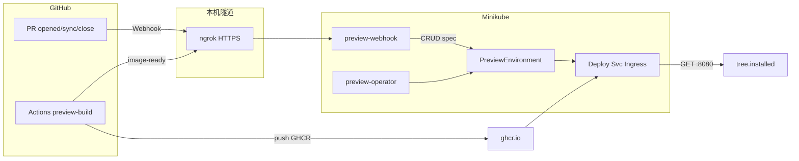
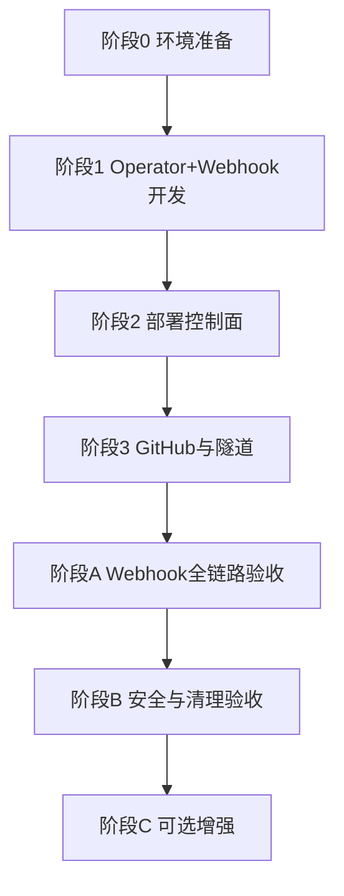

# PR 预览平台 — Minikube 本地实现预案

> 目标：在单机 Minikube 上验证 **Go Operator + preview-webhook** 与生产一致的控制面闭环（GitHub PR → CR → `preview` NS 工作负载 → Ingress）。
>
> 业务演示应用托管于 **GitHub 演示仓**（Ubuntu + 可选 `tree`）；Operator / Webhook 实现规范见 [operator-go设计.md](operator-go设计.md)。
>
> **实施基底：macOS**（Intel / Apple Silicon）；命令为 bash/zsh，容器使用 Docker Desktop。
>
> **端到端流程（推荐主文档）**：[PR预览平台完整流程.md](PR预览平台完整流程.md) §3 Minikube。  
> 对照：[项目评审方案.md](项目评审方案.md)、[镜像构建方案.md](镜像构建方案.md)

---

## 1. 预案定位

| 维度 | 生产方案 | Minikube 预案 |
| --- | --- | --- |
| 控制面 | `preview-operator` + `preview-webhook` | **同组件**；本地 build 后部署到 `preview-system` |
| 集群 | 现网 K8s + Calico NP | `minikube` + Ingress addon |
| 镜像 | 企业 Registry + Actions | **GHCR** + Actions（`demo-repo` workflow） |
| 开发机 | CI / 运维环境 | **macOS** + Homebrew + Docker Desktop + **ngrok**（或同类隧道） |
| 建 CR / 写 image | GitHub Webhook / `image-ready` | **同双通路**；Webhook 经隧道对公网 |
| 业务验证 | 真实应用 | GitHub 上的 `preview-demo`（`tree` 有无） |

**原则**：安全底线与评审方案一致（RBAC、NP、HMAC、白名单）；Minikube 仅替换集群规模、域名与镜像仓库地址。

---

## 2. 架构



**本预案包含**：`preview-webhook` 部署、GitHub 仓库 Webhook、`image-ready` 回调、从 GHCR 拉取镜像。

**本预案不包含**：Operator / Webhook 的 Go 源码（在本仓库实现阶段产出）。

---

## 3. Go Operator（设计引用）

实现规范见 **[operator-go设计.md](operator-go设计.md)**，要点如下：

| 项 | 说明 |
| --- | --- |
| 语言/框架 | Go + controller-runtime（推荐 Kubebuilder v4） |
| GVK | `preview.platform.io/v1alpha1` / `PreviewEnvironment` |
| 写权限 | ClusterRole 管 CR；**Role@preview** 管工作负载 |
| Reconcile | `spec.image` 空 → `Pending`；有镜像 → NP/Deploy/Svc/Ingress；删 CR → Finalizer 有序清理 |
| 样例清单 | [templates/](../templates/) 下 CRD、RBAC、Deployment 等 |

---

## 4. preview-webhook（设计引用）

与 [项目评审方案.md](项目评审方案.md) §4 对齐：

| 路由 | 来源 | 行为 |
| --- | --- | --- |
| `POST /webhook/github` | GitHub `pull_request` | `opened`/`reopened` → Create/Update CR；`synchronize` → 更新 SHA 并**清空 `spec.image`**；`closed` → Delete CR |
| `POST /api/v1/preview/image-ready` | Actions（Bearer） | 仅 patch `spec.image`（并校验 `headSHA`） |

| 约束 | 说明 |
| --- | --- |
| 不写 `status` | 由 Operator 维护 |
| 不建 Deployment | 仅操作 CR `spec` |
| 安全 | `X-Hub-Signature-256`；`ALLOWED_REPOS`；image-ready Bearer Token |

部署样例：[templates/webhook-deployment.yaml](../templates/webhook-deployment.yaml)、[templates/rbac-operator.yaml](../templates/rbac-operator.yaml)。

---

## 5. 演示仓库（GitHub + tree）

在 GitHub 创建演示仓（如 `myorg/preview-demo`），内容可参考 [demo/demo-repo](../demo/demo-repo)：

| 文件 | 说明 |
| --- | --- |
| `Dockerfile` | 基线：`ubuntu:22.04` + `python3`，**不**安装 `tree` |
| `Dockerfile.with-tree` | 参考：PR 在 `Dockerfile` 中增加 `apt install tree` |
| `serve.py` | 监听 `:8080`，返回 JSON：`tree.installed` / `version` |
| `.github/workflows/preview-build.yml` | 构建推送 GHCR + 回调 `image-ready` |

**推荐验收 PR**：

| PR | 分支改动 | 预期 `tree.installed` |
| --- | --- | --- |
| 基线 PR | 不改 `Dockerfile` | `false` |
| 功能 PR | `Dockerfile` 增加 `apt install tree` | `true` |

镜像 tag 与构建流程见 **[镜像构建方案.md](镜像构建方案.md)** §3；Minikube 示例：`ghcr.io/<owner>/preview-demo:pr-{n}-{shortSHA}`。

---

## 6. 实施流程总览



| 阶段 | 目标 | 前置条件 | 主要产出 |
| --- | --- | --- | --- |
| **0** | Minikube + Ingress + 隧道工具 | Docker / minikube / kubectl / ngrok | 集群 Ready；隧道工具可用 |
| **1** | Go Operator + Webhook 源码 | 阶段 0；Go、Kubebuilder | 双镜像可 `minikube image load` |
| **2** | 控制面进集群 | 阶段 1 | Operator + Webhook Running；CRD/RBAC |
| **3** | GitHub 演示仓 + Webhook 配置 | 阶段 2；公网 URL | GHCR 可拉；GitHub 事件到达 Webhook |
| **A** | 双 PR 预览 + Pending 行为 | 阶段 3 | curl 区分 `tree`；sync 清空 image |
| **B** | RBAC / NP / Finalizer | 阶段 A | 关 PR 清 CR；Pod 互访隔离 |
| **C** | 指标、Failed TTL 等 | 阶段 B | 见 [operator-go设计.md](operator-go设计.md) §9 |

**原则**：按表顺序执行；上一阶段验收未通过不进入下一阶段。

---

## 7. 阶段 0 — 环境准备（macOS）

### 7.1 工具安装（Homebrew）

| 工具 | 安装命令 | 用途 |
| --- | --- | --- |
| Docker Desktop | `brew install --cask docker` | minikube `docker` 驱动 |
| minikube | `brew install minikube` | 本地 K8s |
| kubectl | `brew install kubectl` | 集群 CLI |
| ngrok | `brew install ngrok` | GitHub → 本机 Webhook（需注册并 `ngrok config add-authtoken`） |
| Go（阶段 1） | `brew install go` | Operator / Webhook 开发 |

### 7.2 集群与 Ingress

| 步骤 | 操作 | 预期结果 |
| --- | --- | --- |
| 0.1 | 启动 Docker Desktop | `docker info` 正常 |
| 0.2 | `minikube start --cpus=4 --memory=8192 --driver=docker` | 节点 `Ready` |
| 0.3 | `minikube addons enable ingress` | ingress addon `enabled` |
| 0.4 | `kubectl get pods -n ingress-nginx` | Controller `Running` |

### 7.3 预览 URL（Ingress 业务流量）

`/etc/hosts` 示例（PR 号与 repo-slug 以 GitHub 实际为准）：

```bash
sudo tee -a /etc/hosts <<'EOF'
127.0.0.1 pr-1-myorg-preview-demo.preview.local
127.0.0.1 pr-2-myorg-preview-demo.preview.local
EOF
```

| 步骤 | 操作 | 预期结果 |
| --- | --- | --- |
| 0.5 | 另开终端执行 `sudo minikube tunnel`（保持运行） | 本机 80/443 可到达 Ingress |
| 0.6 | `kubectl get ingressclass` | 存在 `nginx` |

**阶段 0 完成标志**：集群 Ready、Ingress 可用、ngrok 已安装并登录。

---

## 8. 阶段 1 — Operator 与 Webhook 开发

规范见 **[operator-go设计.md](operator-go设计.md)** §4–§6。Webhook 可与 Operator 同仓（如 `operator/`）或独立目录。

### 8.1 Operator

| 步骤 | 实现内容 | 自测要点 |
| --- | --- | --- |
| 1.O1 | 定义 API（Spec/Status）与 CRD，与 [templates/crd-previewenvironment.yaml](../templates/crd-previewenvironment.yaml) 对齐 | `make manifests` 生成物与样例一致 |
| 1.O2 | Reconcile：空 image → `Pending`；有 image → 有序创建 NP/Deploy/Svc/Ingress | envtest 或手工 CR |
| 1.O3 | Finalizer 有序删除子资源 | 删 CR 后 `preview` NS 无残留 |
| 1.O4 | `docker build` → `preview-operator:dev` + `minikube image load` | Pod 使用本地镜像 |

### 8.2 Webhook

| 步骤 | 实现内容 | 自测要点 |
| --- | --- | --- |
| 1.W1 | `POST /webhook/github`：校验 HMAC；解析 `pull_request` | 伪造签名 → 401 |
| 1.W2 | `opened`/`reopened`：按 `repoFullName`+`prNumber` 生成 CR 名；`spec.image` 可为空 | CR 存在且 `phase=Pending` |
| 1.W3 | `synchronize`：更新 `headSHA`、**清空 `spec.image`** | Operator 回到 `Pending` |
| 1.W4 | `closed`：Delete CR | Finalizer 由 Operator 清理 |
| 1.W5 | `POST /api/v1/preview/image-ready`：Bearer + 白名单 + SHA 校验 | 仅 patch `spec.image` |
| 1.W6 | `preview-webhook:dev` + `minikube image load` | 镜像在 minikube 内可用 |

**阶段 1 完成标志**：`make test` 通过；`preview-operator:dev` 与 `preview-webhook:dev` 均已载入 minikube。

---

## 9. 阶段 2 — 部署控制面

| 步骤 | 操作 | 预期结果 |
| --- | --- | --- |
| 2.1 | `kubectl apply -f templates/rbac-operator.yaml` | `preview-system`、`preview` NS 与 SA 就绪 |
| 2.2 | 安装 CRD（`make install` 或 `config/crd/bases/`） | CRD 已注册 |
| 2.3 | `kubectl apply -f templates/operator-deployment.yaml`（`REGISTRY=ghcr.io/myorg`） | Operator `READY 1/1` |
| 2.4 | 创建 Secret `preview-webhook-secrets`（见下方命令） | Secret 存在 |
| 2.5 | `kubectl apply -f templates/webhook-deployment.yaml` | Service `preview-webhook:8080` |
| 2.6 | 查看日志 | Operator Watch CR；Webhook 监听 HTTP，无 panic |

```bash
kubectl create secret generic preview-webhook-secrets -n preview-system \
  --from-literal=github-webhook-secret='替换为GitHub Webhook密钥' \
  --from-literal=image-ready-token='替换为image-ready Bearer'
```

Secret 键 `image-ready-token` 映射到容器环境变量 `IMAGE_READY_TOKEN`（见 webhook Deployment 样例）。

**阶段 2 完成标志**：Operator + Webhook Pod 均为 Running。

---

## 10. 阶段 3 — GitHub 演示仓与 Webhook 隧道

### 10.1 推送演示仓

| 步骤 | 操作 | 预期结果 |
| --- | --- | --- |
| 3.1 | 将 [demo/demo-repo](../demo/demo-repo) 推送到 `myorg/preview-demo` | 默认分支含 `Dockerfile`、`serve.py`、workflow |
| 3.2 | Settings → Actions：允许读写 packages（GHCR） | workflow 可 push |
| 3.3 | 仓库 Secrets：`PREVIEW_CALLBACK_URL`、`PREVIEW_CALLBACK_TOKEN` | 与 Webhook 的 `IMAGE_READY_TOKEN` 一致 |

`PREVIEW_CALLBACK_URL` 示例：`https://<ngrok-id>.ngrok-free.app/api/v1/preview/image-ready`

### 10.2 暴露 preview-webhook（ngrok）

| 步骤 | 操作 | 预期结果 |
| --- | --- | --- |
| 3.4 | `kubectl port-forward -n preview-system svc/preview-webhook 18080:8080` | 本机 18080 可访问 |
| 3.5 | `ngrok http 18080` | 获得 `https://xxxx.ngrok-free.app` |
| 3.6 | GitHub Webhooks：`https://xxxx.ngrok-free.app/webhook/github`，事件 `Pull requests`，Secret 与 K8s 一致 | Recent Deliveries 返回 200 |
| 3.7 | 更新 Actions Secret `PREVIEW_CALLBACK_URL` 为 ngrok 基址 + `/api/v1/preview/image-ready` | 与 3.5 一致 |

> ngrok 免费域名重启后会变，需同步更新 GitHub Webhook 与 Actions Secret。

### 10.3 集群拉取 GHCR

| 步骤 | 操作 | 预期结果 |
| --- | --- | --- |
| 3.8 | 若包为 private：创建 `imagePullSecret` 并绑定 `preview` 默认 SA | Pod 可拉 `ghcr.io/...` |
| 3.9 | Operator/Webhook 设置 `REGISTRY=ghcr.io/myorg`、`ALLOWED_REPOS=myorg/preview-demo` | Validating 放行 GHCR 前缀 |

**阶段 3 完成标志**：向演示仓开测试 PR 后，Webhook Delivery 成功且集群内出现对应 `PreviewEnvironment` CR（`spec.image` 可能仍为空，待 Actions 回调）。

---

## 11. 阶段 A — Webhook 全链路验收

| 步骤 | 操作 | 预期结果 |
| --- | --- | --- |
| A.1 | 打开 **基线 PR**（`Dockerfile` 无 tree） | Webhook 创建 CR；Actions 完成后 `image-ready` 写入镜像 |
| A.2 | `kubectl get previewenvironment` | CR 名如 `myorg-preview-demo-pr-<n>`；最终 `phase=Ready` |
| A.3 | `curl -s http://pr-<n>-myorg-preview-demo.preview.local/` | `"tree":{"installed":false}` |
| A.4 | 打开 **含 tree 的 PR**（或向已有 PR push 安装 tree 的 commit） | 新镜像；`installed:true` |
| A.5 | 向已开 PR **push 新 commit**（`synchronize`） | `spec.image` 清空 → `Pending`；新 build 后恢复 `Ready` |
| A.6 | 查看 Webhook / Operator 日志 | HMAC 失败非 200；image-ready SHA 不一致被拒绝 |

**阶段 A 完成标志**：双场景 URL 可访问且 `tree` 与 PR 内容一致；`synchronize` 经历 `Pending` → `Ready`。

---

## 12. 阶段 B — 安全与清理验收

| 步骤 | 操作 | 预期结果 |
| --- | --- | --- |
| B.1 | `kubectl auth can-i delete namespaces --as=system:serviceaccount:preview-system:preview-operator` | `no` |
| B.2 | 两个 PR 同时 `Ready` 时，Pod 互 ping | **失败**（NP 隔离） |
| B.3 | GitHub **Close** 含 tree 的 PR | Webhook 删 CR；`preview` NS 无残留 |
| B.4 | 伪造 Webhook（错误签名） | 401，无 CR 变更 |

**阶段 B 完成标志**：RBAC / NP / 关 PR 清理与 [项目评审方案.md](项目评审方案.md) §5 一致。

---

## 13. 阶段 C — 可选增强

| 步骤 | 操作 | 目的 |
| --- | --- | --- |
| C.1 | 连续 push，验证 workflow `concurrency` + `cancel-in-progress` | 旧 image-ready 不覆盖新 SHA |
| C.2 | 错误镜像 tag | `phase=Failed` |
| C.3 | `/metrics`、Failed TTL、对账 Cron | 生产化（W4） |

---

## 14. 运行时序（Webhook 驱动）

| 序号 | 触发 | Webhook | Operator | 现象 |
| --- | --- | --- | --- | --- |
| ① | PR `opened` | Create CR，`image` 空 | `Pending` | 无 Deployment |
| ② | Actions `image-ready` | patch `spec.image` | 创建 Deploy/Svc/Ingress | Pod 启动 |
| ③ | Pod + Ingress 就绪 | — | `phase=Ready`，写 `url` | curl 200 |
| ④ | PR `synchronize` | 清空 `image` | `Pending`，删工作负载 | curl 失败直至新镜像 |
| ⑤ | 新 build `image-ready` | patch 新镜像 | 重建栈 | curl 恢复 |
| ⑥ | PR `closed` | Delete CR | Finalizer 清理 | 无残留 |

---

## 15. 端到端速查

```bash
# 阶段 0
minikube start --cpus=4 --memory=8192 --driver=docker
minikube addons enable ingress
# 终端1: sudo minikube tunnel
# 终端2: kubectl port-forward -n preview-system svc/preview-webhook 18080:8080
# 终端3: ngrok http 18080

# 阶段 2
kubectl apply -f templates/rbac-operator.yaml
kubectl apply -f templates/crd-previewenvironment.yaml   # 或 make install
kubectl apply -f templates/operator-deployment.yaml
kubectl apply -f templates/webhook-deployment.yaml
# 并创建 preview-webhook-secrets（§9）

# 阶段 3：GitHub 配 Webhook + Actions secrets，开 PR

# 阶段 A
kubectl get previewenvironment -w
curl -s http://pr-<n>-myorg-preview-demo.preview.local/
```

---

## 16. 常见问题

| 现象 | 可能原因 | 处理 |
| --- | --- | --- |
| GitHub Webhook 4xx/5xx | ngrok 未指向 port-forward；Secret 不一致 | 查 Delivery 详情与 Webhook 日志 |
| image-ready 404 重试后失败 | PR 未先创建 CR；`ALLOWED_REPOS` 不匹配 | 先确认 `opened` 事件成功 |
| `ImagePullBackOff` | GHCR private 无 pull secret | §10.3 |
| `curl` 预览 URL 失败 | 未 `minikube tunnel` 或 hosts 未配 | §7.3 |
| CR 长期 Pending（已有镜像） | Operator 未 Running / RBAC 不足 | 查 `preview-system` |
| SHA 不一致被拒绝 | 旧 workflow 回调 | 确认 `concurrency: cancel-in-progress` |

---

## 17. 环境变量

**Operator**

| 变量 | Minikube 示例 |
| --- | --- |
| `PREVIEW_NAMESPACE` | `preview` |
| `PREVIEW_DOMAIN` | `preview.local` |
| `INGRESS_CLASS` | `nginx` |
| `REGISTRY` | `ghcr.io/myorg` |

**Webhook**

| 变量 | 说明 |
| --- | --- |
| `ALLOWED_REPOS` | `myorg/preview-demo` |
| `GITHUB_WEBHOOK_SECRET` | 来自 Secret `github-webhook-secret` |
| `IMAGE_READY_TOKEN` | 来自 Secret `image-ready-token`；与 Actions `PREVIEW_CALLBACK_TOKEN` 一致 |
| `REGISTRY` | GHCR 前缀校验 |

---

## 18. 与生产差异

| 项 | Minikube | 生产 |
| --- | --- | --- |
| Webhook 入口 | ngrok + port-forward | 固定 Ingress + 正式域名 + TLS |
| 镜像仓库 | GHCR | 企业 Registry |
| Operator 副本 | 1 | 多副本 + 固定版本 |
| 对账 Cron | 可选 | W4 必配 |

控制面语义（双通路、RBAC 边界、Finalizer、NP）与生产 **一致**。

---

## 19. 附录：手工调试（非主路径）

Operator 开发早期若尚未部署 Webhook，可临时 `docker build` + `kubectl apply` 样例 CR 调试 Reconcile。

**不得**以此作为本预案验收依据；Webhook 就绪后应改走 §10–§12。

| 资源 | 路径 |
| --- | --- |
| Go 设计 | [operator-go设计.md](operator-go设计.md) |
| Webhook Deployment | [templates/webhook-deployment.yaml](../templates/webhook-deployment.yaml) |
| 演示仓 workflow | [demo/demo-repo/.github/workflows/preview-build.yml](../demo/demo-repo/.github/workflows/preview-build.yml) |
| Actions 参考 | [templates/github-actions-snippet.yml](../templates/github-actions-snippet.yml) |
| 手工 CR（含 tree） | [templates/preview-environment-cr-minikube.yaml](../templates/preview-environment-cr-minikube.yaml) |
| 手工 CR（基线） | [templates/preview-environment-cr-minikube-baseline.yaml](../templates/preview-environment-cr-minikube-baseline.yaml) |
