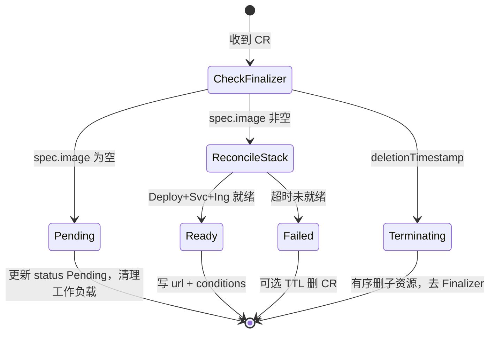

# Preview Operator — Go 语言实现方案（设计稿）

> 本文档描述 **如何用 Go 实现** `preview-operator`，供评审与后续开发对齐。  
> **本仓库当前仅包含文档与 YAML 样例，不包含 Operator 源码。**

对照：[PR预览平台完整流程.md](PR预览平台完整流程.md)、[项目评审方案.md](项目评审方案.md)、[镜像构建方案.md](镜像构建方案.md)、[minikube实现预案.md](minikube实现预案.md)

---

## 1. 技术选型


| 项       | 选择                          | 说明                                                               |
| ------- | --------------------------- | ---------------------------------------------------------------- |
| 语言      | **Go** ≥1.22                | 与 K8s 生态一致                                                       |
| 框架      | **controller-runtime**      | Reconcile、Client、Leader Election                                 |
| 脚手架     | **Kubebuilder** v4（推荐）      | CRD、RBAC marker、`make manifests` / `make deploy`                 |
| 部署位置    | Namespace `preview-system`  | 与业务负载 NS `preview` 分离                                            |
| Webhook | `preview-webhook`（独立 Go 进程） | Minikube 与生产 **同构部署**；见 [minikube实现预案.md](minikube实现预案.md) §4、§9–§10 |


---

## 2. 组件边界


| 组件                 | 语言                     | 职责                                                                          |
| ------------------ | ---------------------- | --------------------------------------------------------------------------- |
| `preview-operator` | Go                     | Watch `PreviewEnvironment`；写 `status`；在 `preview` NS 创建/更新/删除工作负载；Finalizer |
| `preview-webhook`  | Go（HTTP）               | GitHub / image-ready → CRUD `spec`；**不改** `status`、不建 Deployment            |
| 演示业务               | 容器镜像（`demo/demo-repo`） | 仅验证「不同 PR → 不同镜像」；**不是** Operator 代码                                        |


---

## 3. 规划目录结构（实现时创建）

实现代码建议放在本仓根目录或子目录 `operator/`（二选一，团队定稿即可）：

```text
operator/                          # 或仓库根目录直接展开
├── api/v1alpha1/
│   └── previewenvironment_types.go   # Spec/Status 类型定义
├── cmd/
│   └── main.go                       # Manager 入口
├── internal/controller/
│   └── previewenvironment_controller.go
├── config/
│   ├── crd/bases/                    # 由 controller-gen 生成
│   ├── rbac/                         # 与 templates/rbac-operator.yaml 对齐
│   └── manager/                      # Deployment / ServiceAccount
├── Makefile
├── go.mod
└── Dockerfile                        # 多阶段构建 operator 镜像
```

**本仓库已提供（无 Go 源码）**：

```text
docs/operator-go设计.md              # 本文
templates/crd-*.yaml                 # CRD / RBAC / Operator Deployment 样例
demo/                                # 演示仓 + 样例 CR + 构建脚本
```

---

## 4. API 设计（`preview.platform.io/v1alpha1`）

与 [templates/crd-previewenvironment.yaml](../templates/crd-previewenvironment.yaml)、[templates/preview-environment-cr.yaml](../templates/preview-environment-cr.yaml) 一致。

### 4.1 Spec（用户 / Webhook 可写）


| 字段              | 类型       | 必填  | 说明                            |
| --------------- | -------- | --- | ----------------------------- |
| `repoFullName`  | string   | 是   | 如 `myorg/preview-demo`        |
| `prNumber`      | int32    | 是   | >0                            |
| `headSHA`       | string   | 是   | 建议 40 位十六进制；CRD `minLength: 7` |
| `headBranch`    | string   | 否   | 展示用                           |
| `image`         | string   | 否   | 空 → Pending，不建 Deployment     |
| `host`          | string   | 是   | Ingress Host                  |
| `profile`       | string   | 否   | 渲染配置档，默认 `default`            |
| `replicas`      | int32    | 否   | 默认 1                          |
| `containerPort` | int32    | 否   | 默认 8080（与 demo `serve.py` 一致） |
| `resources`     | object   | 否   | 同 Pod resources               |
| `env`           | []EnvVar | 否   | 注入容器                          |
| `secretRef`     | string   | 否   | 引用已有 Secret                   |
| `ttlHours`      | int32    | 否   | 二期 TTL                        |


### 4.2 Status（仅 Operator 写）


| 字段            | 说明                                                |
| ------------- | ------------------------------------------------- |
| `phase`       | `Pending` | `Ready` | `Failed` | `Terminating`    |
| `observedSHA` | 已调和的 `headSHA`                                    |
| `url`         | `https://{host}` 或 Minikube 下 `http://{host}`     |
| `conditions`  | `ImageReady`、`DeploymentAvailable`、`IngressReady` |


### 4.3 命名与标签


| 项                  | 规则                                    | Minikube 示例                                 |
| ------------------ | ------------------------------------- | ------------------------------------------- |
| CR `metadata.name` | `{repo-slug}-pr-{n}`，≤63              | `myorg-preview-demo-pr-42`                  |
| `repo-slug`        | `repoFullName` 中 `/` 换 `-`            | `myorg/preview-demo` → `myorg-preview-demo` |
| Host               | `pr-{n}-{repo-slug}.{PREVIEW_DOMAIN}` | `pr-42-myorg-preview-demo.preview.local`    |
| Finalizer          | `preview.platform.io/finalizer`       | 仅 Operator 添加/移除                            |
| 工作负载标签             | `preview.platform.io/cr` = CR 名       | 删除时按此 label + ownerRef                      |


---

## 5. Reconcile 逻辑（设计）




**有序创建**（有镜像）：NetworkPolicy → ConfigMap → Secret（若需要）→ Deployment → Service → Ingress。  
**有序删除**（Finalizer）：Ingress → Deployment → Service → NetworkPolicy → ConfigMap → Secret（owned）。

**Minikube 简化**：

- 本地镜像 tag 可无 Registry 前缀；Validating 在本地可配置为放行 `preview-demo:`*。
- NetworkPolicy 可在阶段 B 再强制；阶段 A 可先仅 Deployment + Service + Ingress。

**环境变量（Operator Deployment）**：


| 变量                  | 默认        | 说明                         |
| ------------------- | --------- | -------------------------- |
| `PREVIEW_NAMESPACE` | `preview` | 工作负载 NS                    |
| `PREVIEW_DOMAIN`    | —         | 校验/拼接 URL                  |
| `INGRESS_CLASS`     | `nginx`   | Ingress `ingressClassName` |
| `REGISTRY`          | —         | 生产镜像前缀校验；Minikube 可空       |
| `RECONCILE_TIMEOUT` | `10m`     | 未就绪 → Failed               |


---

## 6. RBAC 与部署

- ClusterRole：仅 `previewenvironments` + `namespaces` 只读（见 [templates/rbac-operator.yaml](../templates/rbac-operator.yaml)）。
- Role@`preview`：Deployment / Service / Ingress / NetworkPolicy 写权限。
- Operator Deployment 样例：[templates/operator-deployment.yaml](../templates/operator-deployment.yaml)。

安装顺序：`CRD` → `RBAC` → `preview` NS 默认 deny NP（可选）→ `Operator Deployment` → 样例 CR。

---

## 7. 与 Minikube 演示的衔接


| 步骤             | 谁来做                                       | 产物                                          |
| -------------- | ----------------------------------------- | ------------------------------------------- |
| 推送演示仓          | GitHub `myorg/preview-demo`（含 workflow）   | PR 生命周期事件                                   |
| 建 CR / 写 image | **preview-webhook**（GitHub + image-ready） | `PreviewEnvironment` CR                     |
| 构建镜像           | GitHub Actions → GHCR（规范见 [镜像构建方案.md](镜像构建方案.md)） | `ghcr.io/<owner>/preview-demo:pr-{n}-{sha}` |
| 调和工作负载         | **preview-operator**                      | `preview` NS 内 Deploy/Ingress               |
| 验证             | `curl` 预览 Host                            | JSON 中 `tree.installed` true/false          |


主路径示意：

```text
make install                                      # CRD
kubectl apply -f templates/rbac-operator.yaml
kubectl apply -f templates/operator-deployment.yaml
kubectl apply -f templates/webhook-deployment.yaml
# ngrok → GitHub Webhook；开 PR → Actions → image-ready
```

手工 `kubectl apply` 样例 CR 仅作 Operator 开发期调试，见 [minikube实现预案.md](minikube实现预案.md) §19。

---

## 8. 测试策略（设计层）


| 层级  | 内容                                             |
| --- | ---------------------------------------------- |
| 单元  | CR 名/Host 生成、label 合并、Finalizer 顺序（表驱动测试）      |
| 集成  | envtest 或 Minikube：Pending 无 Deploy、删 CR 无残留   |
| E2E | demo-repo 双 PR + 双 CR；curl 断言 `tree.installed` |


---

## 9. 不在首期实现

- embed Helm chart 可先用硬编码 Deployment 模板，后再抽 `charts/preview-app`
- Cron 对账、Prometheus 指标、Failed CR 自动删（阶段 C / 生产）

`preview-webhook` 与 GitHub 集成纳入 Minikube 主路径，实现要求见 [minikube实现预案.md](minikube实现预案.md) §9.2 与 [项目评审方案.md](项目评审方案.md) §4。

---

## 10. 相关样例路径


| 资源                  | 路径                                                                                                  |
| ------------------- | --------------------------------------------------------------------------------------------------- |
| CRD 清单              | [templates/crd-previewenvironment.yaml](../templates/crd-previewenvironment.yaml)                   |
| 通用 CR 样例            | [templates/preview-environment-cr.yaml](../templates/preview-environment-cr.yaml)                   |
| Minikube CR 样例      | [templates/preview-environment-cr-minikube.yaml](../templates/preview-environment-cr-minikube.yaml) |
| Operator Deployment | [templates/operator-deployment.yaml](../templates/operator-deployment.yaml)                         |
| Webhook Deployment  | [templates/webhook-deployment.yaml](../templates/webhook-deployment.yaml)                           |
| 演示仓                 | [demo/demo-repo](../demo/demo-repo)                                                                 |


