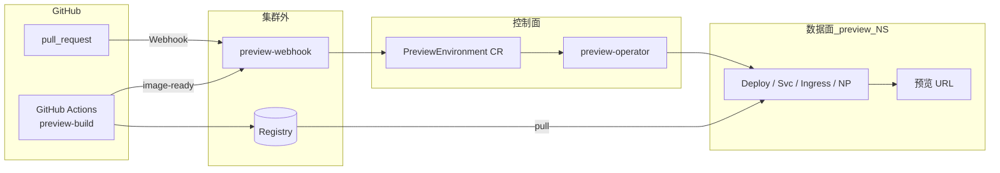
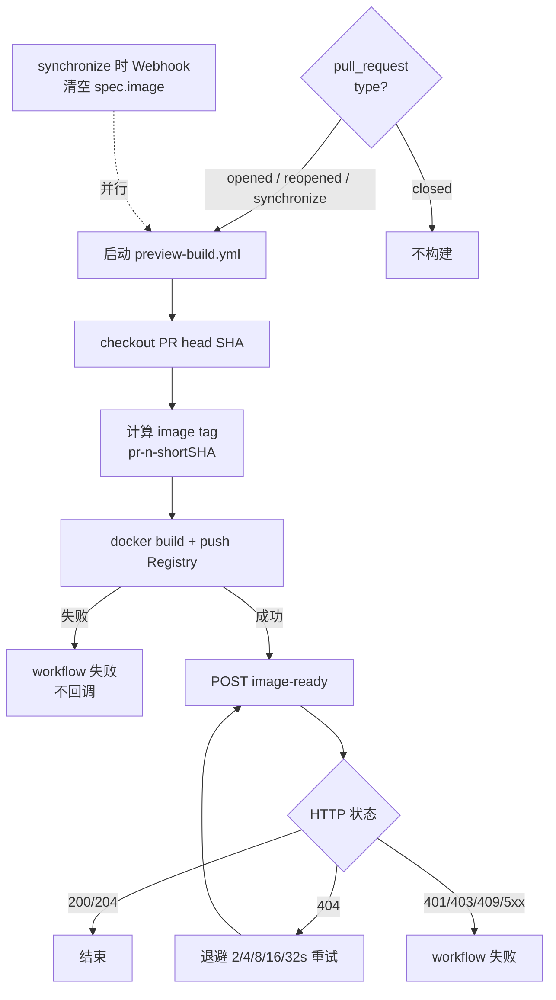
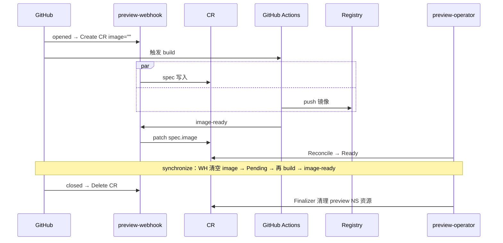
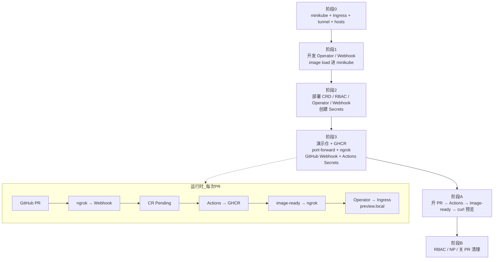
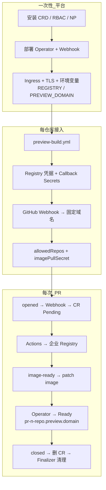
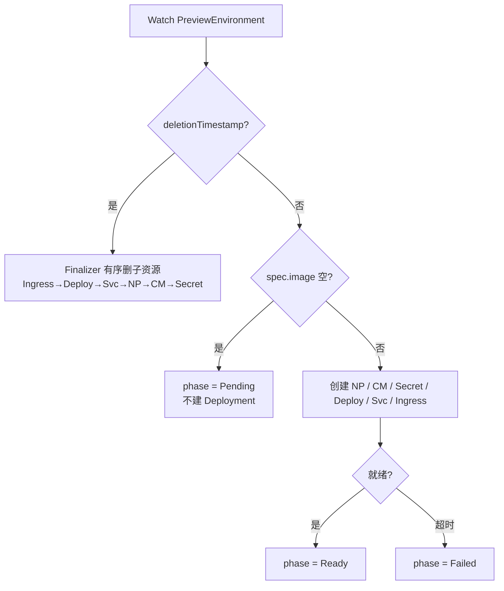

# PR 预览平台 — 流程图

> 镜像构建统一使用 **GitHub Actions**。Minikube 与正式环境控制语义一致，差异在 Webhook 入口与 Registry。

---

## 1. 总览架构

---

## 2. 镜像构建（GitHub Actions）

---

## 3. PR 生命周期（双通路时序）

---

## 4. Minikube 流程

---

## 5. 正式环境流程

---

## 6. Operator Reconcile（两环境相同）

