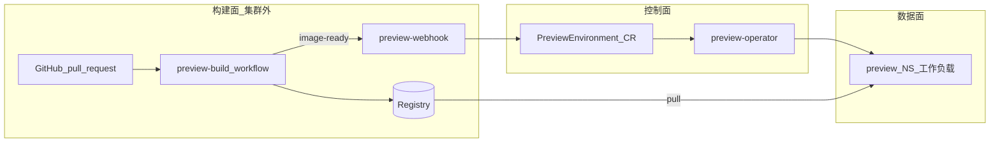
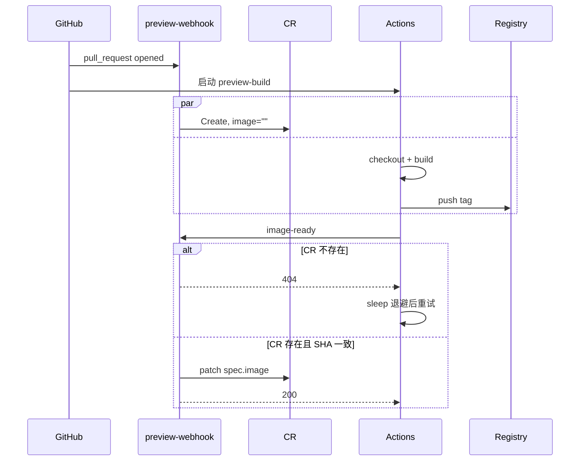

# PR 预览平台 — 镜像构建方案

> 本文档定义 **PR 触发后的镜像构建** 如何标准化实施，并与控制面（Webhook / CR / Operator）的 `image-ready` 回调衔接。  
> 对照：[项目评审方案.md](项目评审方案.md) §4、[operator-go设计.md](operator-go设计.md)、[minikube实现预案.md](minikube实现预案.md)

---

## 1. 定位与原则

### 1.1 在整体架构中的位置




| 平面      | 职责                             | 本方案覆盖 |
| ------- | ------------------------------ | ----- |
| **构建面** | 检出 PR 代码、构建镜像、推送 Registry、回调平台 | **是** |
| 控制面     | CR 生命周期、`spec.image` 写入        | 仅接口约定 |
| 数据面     | 按 `spec.image` 部署预览            | 不涉及构建 |


### 1.2 设计原则（MUST）

1. **镜像构建统一使用 GitHub Actions**：在业务仓 `.github/workflows/preview-build.yml` 中完成 checkout、build、push 与 `image-ready` 回调；不在 `preview` / `preview-system` 内构建镜像。
2. **业务 CI 不得访问 K8s**：禁止 `kubectl apply`、禁止直接改 Deployment；仅允许 `POST /api/v1/preview/image-ready`。
3. **镜像 tag 平台可校验**：须符合 Validating 规则（`REGISTRY` 前缀 + `pr-{n}-{shortSHA}`），与 CR 的 `prNumber`、`headSHA` 可关联。
4. **与 PR 生命周期解耦、与 commit 强绑定**：同一 PR 新 push → 新 tag；旧 workflow 不得用旧镜像覆盖新 commit（`concurrency` + SHA 校验）。
5. **构建失败不回调 image-ready**：平台保持 `Pending`；由开发者看 Actions 日志，不在 Operator 侧模拟构建。

> 端到端步骤（Minikube / 正式）见 **[PR预览平台完整流程.md](PR预览平台完整流程.md)**。

### 1.3 二期可选（本期不实现）

- CR `status.buildPhase` / GitHub Checks 回写（见 §8）
- 多架构 manifest、SBOM 强制门禁

---

## 2. 触发与编排

### 2.1 谁触发构建


| 事件          | GitHub `pull_request` action | 构建 workflow          | 控制面 Webhook           |
| ----------- | ---------------------------- | -------------------- | --------------------- |
| 开 PR        | `opened`                     | **运行**               | Create CR，`image` 空   |
| 重开 PR       | `reopened`                   | **运行**               | Update CR             |
| PR 新 commit | `synchronize`                | **运行**（取消同 PR 旧 run） | 更新 SHA，**清空 `image`** |
| 关 PR        | `closed`                     | **不运行**              | Delete CR             |


构建与 Webhook **并行启动**：不要求「先 CR 后 build」，但 **image-ready 必须在 CR 存在之后** 才能成功（见 §6）。

### 2.2 标准 Workflow 契约

每个接入预览的 **业务仓库** MUST 包含 `.github/workflows/preview-build.yml`（可从平台模板复制）：


| 步骤  | 动作                                         | 失败时                       |
| --- | ------------------------------------------ | ------------------------- |
| 1   | `checkout` PR **head** SHA（非 merge commit） | workflow 失败，不回调           |
| 2   | 计算 `image` tag（§3）                         | —                         |
| 3   | `docker login` + `build-push` 到 Registry   | workflow 失败，不回调           |
| 4   | `POST image-ready`（§5）                     | workflow 失败；平台仍 `Pending` |


参考实现：

- 生产模板：[templates/github-actions-snippet.yml](../templates/github-actions-snippet.yml)
- Minikube 演示：[demo/demo-repo/.github/workflows/preview-build.yml](../demo/demo-repo/.github/workflows/preview-build.yml)

### 2.3 并发与取消（MUST）

```yaml
concurrency:
  group: preview-${{ github.repository }}-${{ github.event.pull_request.number }}
  cancel-in-progress: true
```


| 场景                  | 行为                                                 |
| ------------------- | -------------------------------------------------- |
| 连续 push 同一 PR       | 取消上一次 workflow；仅最新 commit 应完成 push + image-ready   |
| 旧 run 在取消前已 push 镜像 | 允许 Registry 存在旧 tag；平台 **拒绝** SHA 不一致的 image-ready |
| 慢 build             | CR 长期 `Pending` 为预期；指标见评审方案 P95                    |


---

## 3. 镜像命名与 Registry

### 3.1 Tag 规范（MUST）

```
{REGISTRY}/{app_name}:pr-{prNumber}-{shortSHA}
```


| 段          | 规则                                                      | 示例                     |
| ---------- | ------------------------------------------------------- | ---------------------- |
| `REGISTRY` | 平台配置的镜像仓库根（生产为企业 Registry；Minikube 为 `ghcr.io/<owner>`） | `registry.example.com` |
| `app_name` | 业务仓内固定，与 CR 无强绑定；建议与仓库名或产品名一致                           | `myapp`、`preview-demo` |
| `prNumber` | 与 `spec.prNumber` 一致                                    | `42`                   |
| `shortSHA` | PR head commit 前 **7** 位十六进制，小写                         | `a1b2c3d`              |


**完整示例**

- 生产：`registry.example.com/myapp:pr-42-a1b2c3d`
- Minikube：`ghcr.io/myorg/preview-demo:pr-42-a1b2c3d`

### 3.2 Validating 对齐

平台 Webhook / ValidatingWebhook MUST：

- 拒绝 `image` 不以 `REGISTRY` 为前缀的 patch；
- 拒绝 `headSHA` 与 CR 当前 `spec.headSHA` 不一致的 image-ready（SHOULD 在首期实现）。

### 3.3 Registry 与集群拉取


| 环境              | 推送身份                                                    | 集群拉取                                                   |
| --------------- | ------------------------------------------------------- | ------------------------------------------------------ |
| 生产              | 业务仓 Secret `REGISTRY_USER` / `REGISTRY_PASSWORD` 或 OIDC | `preview` NS 配置 `imagePullSecrets` 或节点可拉公网/内网 Registry |
| Minikube + GHCR | GitHub Actions `GITHUB_TOKEN` + `packages: write`       | private 包时需 `imagePullSecret` 绑定 `preview` 默认 SA       |


Operator **不负责** 构建推送；仅在校验通过后把 `spec.image` 交给 Reconcile 拉取。

---

## 4. 构建内容约定

### 4.1 Dockerfile 位置与上下文


| 项             | 约定                                                 |
| ------------- | -------------------------------------------------- |
| 默认路径          | 仓库根目录 `Dockerfile`                                 |
| build context | 仓库根 `.`（首期不强制 monorepo 子路径）                        |
| PR 差异         | 预览应反映 **PR head 分支** 的文件内容（含 PR 内对 Dockerfile 的修改） |


### 4.2 与预览运行时的衔接


| 项    | 约定                                                           |
| ---- | ------------------------------------------------------------ |
| 监听端口 | 与 CR `spec.containerPort` 一致，默认 **8080**                     |
| 健康检查 | Deployment 使用 HTTP GET `/`（或业务约定路径）                          |
| 演示仓  | `serve.py` 返回 JSON，用于验收 `tree.installed` 等（见 minikube 预案 §5） |


业务仓若使用非 8080 端口，须在平台侧 CR 模板或 Webhook 生成 CR 时写入 `containerPort`（或由 profile 渲染）。

### 4.3 构建参数（可选）

首期 workflow **不强制** `build-args`；业务仓可自行在 Dockerfile / workflow 中增加：

```yaml
build-args: |
  APP_ENV=preview
```

平台不解析 build-args；仅校验最终 `image` 字符串。

---

## 5. 构建完成 → image-ready

### 5.1 请求规范（MUST）


| 项            | 值                                                |
| ------------ | ------------------------------------------------ |
| Method       | `POST`                                           |
| Path         | `/api/v1/preview/image-ready`                    |
| Header       | `Authorization: Bearer <PREVIEW_CALLBACK_TOKEN>` |
| Content-Type | `application/json`                               |


**Body**

```json
{
  "repoFullName": "myorg/myapp",
  "prNumber": 42,
  "headSHA": "a1b2c3d4e5f6789012345678abcdef012345678",
  "image": "registry.example.com/myapp:pr-42-a1b2c3d"
}
```


| 字段             | 要求                                          |
| -------------- | ------------------------------------------- |
| `repoFullName` | 与 GitHub `repository` 一致，须在 `ALLOWED_REPOS` |
| `prNumber`     | 与 CR 一致                                     |
| `headSHA`      | **完整** 40 位（推荐）；至少与 CR 当前 `spec.headSHA` 一致 |
| `image`        | 符合 §3.1                                     |


### 5.2 Webhook 处理逻辑（MUST）

1. 校验 Bearer Token。
2. 校验 `repoFullName` 在白名单。
3. 按 `{repo-slug}-pr-{n}` 查找 CR；不存在 → **404**（触发 CI 重试）。
4. 校验 `headSHA` == `spec.headSHA`；不一致 → **409**（旧构建回调）。
5. Patch `spec.image` = 请求体 `image`；**不**改 `status`。
6. 返回 **200** 或 **204**。

### 5.3 CI 侧重试（MUST）

当 Webhook 返回 **404**（CR 尚未创建，竞态）时，workflow MUST 指数退避重试：

**2s → 4s → 8s → 16s → 32s**（与评审方案、模板一致）。

非 404 错误（401/403/409/5xx）**不得** 无限重试；失败即 workflow failed。

### 5.4 构建失败时


| 情况                   | 平台 CR                             | 用户可见                   |
| -------------------- | --------------------------------- | ---------------------- |
| Docker build/push 失败 | `Pending`，`spec.image` 空或旧值已清空    | Actions 红叉             |
| image-ready 重试耗尽     | `Pending`                         | Actions 红叉             |
| 镜像拉取失败（集群内）          | Operator → `Failed`（Reconcile 超时） | `kubectl` / 预览 URL 不可用 |


**不在首期** 由平台触发「重新构建」；重试由开发者 `git push` 或 Re-run workflow。

---

## 6. 时序与竞态




| 竞态                             | 处理方                                                  |
| ------------------------------ | ---------------------------------------------------- |
| image-ready 早于 CR              | CI 404 退避                                            |
| synchronize 清空 image 后旧 CI 仍回调 | Webhook 409（SHA 不一致）                                 |
| 新 CI 与旧 CI 同时 push 不同 tag      | `concurrency` 取消旧 run；Registry 可有多 tag，仅最新 SHA 写入 CR |


---

## 7. 业务仓接入清单

平台管理员为每个接入仓库配置：


| #   | 配置项                      | 位置                          | 说明                                     |
| --- | ------------------------ | --------------------------- | -------------------------------------- |
| 1   | `preview-build.yml`      | 业务仓 `.github/workflows/`    | 从模板复制并改 `REGISTRY`、`APP_NAME`          |
| 2   | `Dockerfile`             | 业务仓根目录                      | 暴露约定端口                                 |
| 3   | `PREVIEW_CALLBACK_URL`   | 业务仓 Actions Secret          | 指向平台 `.../api/v1/preview/image-ready`  |
| 4   | `PREVIEW_CALLBACK_TOKEN` | 业务仓 Secret                  | 与平台 `IMAGE_READY_TOKEN` 一致             |
| 5   | Registry 凭据              | 业务仓 Secret 或 `GITHUB_TOKEN` | 能 push 到 `REGISTRY`                    |
| 6   | 仓库 Webhook               | GitHub 仓库设置                 | 指向 `/webhook/github`（**非** 本方案，但是前置依赖） |
| 7   | `allowedRepos`           | 平台 Webhook 环境变量             | 包含该 `org/repo`                         |
| 8   | `imagePullSecret`        | 集群 `preview` NS             | 若 Registry 对集群私有                       |


**试点顺序**（与评审方案 §7 一致）：`allowedRepos` → Dockerfile → Actions secrets → 平台 Webhook → 测试 PR open/sync/close。

---

## 8. 可观测性与二期扩展

### 8.1 首期可观测


| 信号      | 来源                                    |
| ------- | ------------------------------------- |
| 构建是否成功  | GitHub Actions UI / API               |
| 是否已通知平台 | workflow 日志 `Notify preview platform` |
| 平台是否已部署 | CR `status.phase`、`kubectl get pe`    |
| 端到端耗时   | PR 打开时间 → `phase=Ready`（评审指标 P95）     |


### 8.2 二期可选（CR 扩展）

在 CR `status` 增加构建态（由 Webhook 或独立 `build-status` 回调写入，**仍不** 由 Operator 触发构建）：


| 字段                    | 含义                                                     |
| --------------------- | ------------------------------------------------------ |
| `status.buildPhase`   | `Queued` / `Building` / `Pushed` / `Failed`            |
| `status.lastBuildURL` | 指向 Actions run                                         |
| GitHub Check Run      | Webhook 在 `opened` 时创建 Check，`image-ready` 后标记 success |


首期 **不实现** 上述字段，避免构建面与控制面耦合过紧。

---

## 9. 环境差异


| 项          | 生产                                                                    | Minikube                                                                         |
| ---------- | --------------------------------------------------------------------- | -------------------------------------------------------------------------------- |
| Registry   | 企业 `registry.example.com`                                             | `ghcr.io/<owner>`                                                                |
| 推送         | `REGISTRY_USER/PASSWORD`                                              | `GITHUB_TOKEN` + `packages: write`                                               |
| 回调 URL     | 固定 Ingress 域名                                                         | ngrok + port-forward（会变，需同步 Secret）                                              |
| Validating | 严格 `REGISTRY` 前缀                                                      | 可配置放行 `preview-demo:`*（仅本地调试）                                                    |
| 模板         | [github-actions-snippet.yml](../templates/github-actions-snippet.yml) | [demo/demo-repo workflow](../demo/demo-repo/.github/workflows/preview-build.yml) |


构建流程语义 **一致**；仅 Registry 与回调入口不同。

---

## 10. 验收要点


| #   | 场景                      | 预期                                                       |
| --- | ----------------------- | -------------------------------------------------------- |
| 1   | 开 PR                    | Actions 运行；CR `Pending`；构建成功后 `spec.image` 有值 → `Ready`  |
| 2   | push 新 commit           | 旧 workflow 取消；CR `image` 清空 → `Pending`；新构建完成后恢复 `Ready` |
| 3   | 故意让 build 失败            | 无 image-ready；CR 保持 `Pending`                            |
| 4   | 手工发错误 SHA 的 image-ready | 409，CR `image` 不变                                        |
| 5   | 关 PR                    | workflow 不跑；CR 删除；Registry tag 可保留（清理策略二期）               |
| 6   | 镜像 tag 不符合规范            | Validating 拒绝 patch                                      |


---

## 11. 相关文档与模板


| 资源           | 路径                                                                                                          |
| ------------ | ----------------------------------------------------------------------------------------------------------- |
| **完整流程（Minikube + 正式）** | [PR预览平台完整流程.md](PR预览平台完整流程.md)                                                                          |
| 评审方案（双通路总览）  | [项目评审方案.md](项目评审方案.md) §4                                                                                   |
| Minikube 联调补充  | [minikube实现预案.md](minikube实现预案.md) §5、§10–§11                                                               |
| Actions 生产模板 | [templates/github-actions-snippet.yml](../templates/github-actions-snippet.yml)                             |
| 演示 workflow  | [demo/demo-repo/.github/workflows/preview-build.yml](../demo/demo-repo/.github/workflows/preview-build.yml) |


