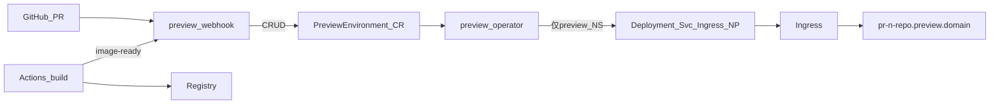

# PR 预览平台 — 项目评审方案

---

## 1. 摘要

| 项        | 内容                                                                                                        |
| -------- | --------------------------------------------------------------------------------------------------------- |
| **价值**   | GitHub PR 打开自动获得独立预览 URL，关闭后 2 分钟内回收，缩短 Code Review 与联调周期                                                 |
| **方案**   | Go Operator + Webhook；`PreviewEnvironment` CR 声明式管理；**单一** Namespace `preview` + Label + NetworkPolicy 隔离 |
| **安全底线** | 禁止「一 PR 一 NS」；自动化 **不得** `delete namespace`；工作负载写权限 **仅** `Role@preview`                                  |
| **排期**   | 约 4 周：W1 CRD/Reconcile → W2 安全/Finalizer → W3 GitHub 集成 → W4 对账/试点                                        |
| **指标**   | PR 打开到 URL：P95 < 10min；PR 关闭到清零：P95 < 2min；误删非 preview 资源：0                                               |

---

## 2. 架构

| 组件                 | 职责                                                                       |
| ------------------ | ------------------------------------------------------------------------ |
| `preview-webhook`  | 接收 GitHub / Actions HTTP，对 CR 做 CRUD 与 `spec` patch；**不**创建 Deployment、**不**写 `status` |
| `preview-operator` | Reconcile CR → `preview` NS 资源；Finalizer 清理；维护 `status`                  |
| GitHub Actions     | 构建 push 镜像 → 回调 `image-ready`                                            |
| Cron（W4）           | 对账 open PR 与 CR，清理孤儿                                                     |

**边界**：控制面 = Cluster CR；数据面 = `preview` NS（Label）；构建面 = Actions + Registry（集群外）。

**关键决策**：固定 NS `preview`（避免误删其他 NS）；Operator 独占写 `preview`；镜像由 Actions 构建；首期仅 GitHub `pull_request`。

**依赖**：K8s ≥1.23；支持 NP 的 CNI；Ingress + 通配符 DNS/TLS；可拉取 Registry。

---

## 3. CRD 与命名

| 项         | 值                                                            |
| --------- | ------------------------------------------------------------ |
| GVK       | `preview.platform.io/v1alpha1` `PreviewEnvironment`（Cluster） |
| CR 名      | `{repo-slug}-pr-{n}`，≤63 字符                                  |
| Host      | `pr-{n}-{repo-slug}.{PREVIEW_DOMAIN}`                        |
| Finalizer | `preview.platform.io/finalizer`（**仅 Operator** 添加）           |

**Spec**：`repoFullName`、`prNumber`、`headSHA`、`host`、`image`（空则 Pending）、`profile`/`replicas`/`ttlHours` 可选。

**Status**：`phase` 取 `Pending` | `Ready` | `Failed` | `Terminating`；`Ready` 需同时满足 `ImageReady`、`DeploymentAvailable`、`IngressReady`。

**Validating**：`prNumber>0`；镜像前缀 `REGISTRY`；活跃数 < `max-active-previews`（`Pending\|Ready`，`Failed` 不计）。

**镜像 tag**：`{REGISTRY}/{app}:pr-{n}-{shortSHA}`

---

## 4. GitHub 集成

| `action`              | 行为                                      |
| --------------------- | --------------------------------------- |
| `opened` / `reopened` | Create/Update CR                        |
| `synchronize`         | 更新 SHA/分支；**清空 `spec.image`** → Pending |
| `closed`              | Delete CR → Finalizer 清理                |

**双通路**：① 仓库 Webhook → `/webhook/github`（PR 生命周期）；② Actions build 完 → `/api/v1/preview/image-ready`（仅 patch `spec.image`）。关 PR 只走路径 ①。

**镜像构建**：统一使用 **GitHub Actions**（触发、tag、Registry、`image-ready`）见 **[镜像构建方案.md](镜像构建方案.md)**；Minikube / 正式端到端步骤见 **[PR预览平台完整流程.md](PR预览平台完整流程.md)**。

**安全**：MUST 校验 `X-Hub-Signature-256`；白名单 `allowedRepos`；image-ready 校验仓库白名单，**SHOULD** 校验 `headSHA`；404 指数退避（2+4+8+16+32s）。

**W1 禁止**：生产仓库 Webhook 指向未完成 Finalizer/NP 的环境。

**慢 build**：长期 Pending 为预期；Actions 建议 `concurrency` + `cancel-in-progress`；image-ready 拒绝 SHA 不一致。

---

## 5. 安全与 RBAC

**MUST 禁令**

1. 不得 `delete namespace` 或持有 `namespaces/delete`。
2. 工作负载 **仅** `preview` NS；删除 **仅** 删 CR + Finalizer。
3. 禁止无 `cr` 限定的批量 label 删除。
4. Webhook 必须 HMAC 签名校验。

| SA                 | 可写范围                                                     |
| ------------------ | -------------------------------------------------------- |
| `preview-operator` | ClusterRole：CR + NS 只读；工作负载写 = **Role@preview** only     |
| `preview-webhook`  | 仅 `previewenvironments` CRUD；无 Deployment/Ingress/status |

**隔离**：统一 Label 前缀 `preview.platform.io/*`；NP 默认拒绝 + 按 CR 隔离；清理顺序：Ingress → Deployment → Service → NetworkPolicy → ConfigMap → Secret（owned）。

**W2 验收**：`auth can-i delete namespaces` → no；`create deployments -n production` → no；两 PR Pod 互 ping 失败；伪造 Webhook 401；PR close 无残留。

---

## 6. Reconcile

1. `deletionTimestamp` → Finalizer 有序删子资源 → 移除 Finalizer。
2. `spec.image` 空 → Pending，不建 Deployment。
3. 有 image：NP → ConfigMap → Secret → Deployment → Service → Ingress（Label + ownerRef）。
4. 渲染工作负载（首期可硬编码模板，后续 embed chart `preview-app`）；10min 未就绪 → `Failed`；`FAILED_CR_TTL_HOURS` 到期后删 CR 并告警。

---

## 7. 部署与排期

| 变量                                  | 说明                |
| ----------------------------------- | ----------------- |
| `PREVIEW_DOMAIN`                    | 通配符域              |
| `REGISTRY` / `REGISTRY_EGRESS_CIDR` | 镜像白名单 + NP egress |
| `GITHUB_ORG` / `allowedRepos`       | 接入仓库              |
| `max-active-previews`               | 全局活跃上限            |

**拓扑**：`preview-system`（Operator/Webhook/CRD）；`preview`（工作负载）。安装：CRD → RBAC → NP → Operator → Webhook → Validating。

| 周      | 目标                           | 验收                                |
| ------ | ---------------------------- | --------------------------------- |
| **W1** | CRD + Reconcile 骨架           | 手工 CR → `phase=Ready` 且可访问；**不接** 生产 Webhook |
| **W2** | Finalizer、NP、RBAC、Validating | SEC + auth can-i                  |
| **W3** | Webhook、Actions、image-ready  | open 10min 可访问；close 2min 清零      |
| **W4** | 对账 Cron、metrics、试点           | P0/P1 全量                          |

**试点**：`allowedRepos` → Dockerfile → Actions → secrets → Webhook → 测试 PR open/close。

**二期**：Deployment 回写、TTL 过期、Prometheus、GitLab、`/redeploy` 评论。

---

## 8. 测试要点

- 单元：`CRName`/`Host`/签名/render label
- 集成：Pending 无 Deploy；删 CR 无残留；synchronize 分工；Failed TTL；SHA 不一致拒绝
- E2E：完整生命周期；10 CR 并发；配额满 429
- **必测**：`myorg/myapp` 与 `otherorg/myapp` 同 PR 号 → 不同 CR 名与 host

---

## 9. 附录

| 资源                     | 路径                                                                                                  |
| ---------------------- | --------------------------------------------------------------------------------------------------- |
| **流程图（Minikube + 正式）** | [流程图.md](流程图.md)                                                                                    |
| 完整流程（实施步骤）              | [PR预览平台完整流程.md](PR预览平台完整流程.md)                                                                  |
| Go Operator 设计（无源码）    | [operator-go设计.md](operator-go设计.md)                                                                |
| 镜像构建（GitHub Actions 契约） | [镜像构建方案.md](镜像构建方案.md)                                                                          |
| Minikube 补充（FAQ、阶段细节） | [minikube实现预案.md](minikube实现预案.md)                                                                  |
| CRD 样例                 | [templates/crd-previewenvironment.yaml](../templates/crd-previewenvironment.yaml)                   |
| Operator Deployment 样例 | [templates/operator-deployment.yaml](../templates/operator-deployment.yaml)                         |
| Webhook Deployment 样例  | [templates/webhook-deployment.yaml](../templates/webhook-deployment.yaml)                           |
| 样例 CR（生产）              | [templates/preview-environment-cr.yaml](../templates/preview-environment-cr.yaml)                   |
| 样例 CR（Minikube）        | [templates/preview-environment-cr-minikube.yaml](../templates/preview-environment-cr-minikube.yaml) |
| RBAC                   | [templates/rbac-operator.yaml](../templates/rbac-operator.yaml)                                     |
| NetworkPolicy          | [templates/networkpolicy-isolate.yaml](../templates/networkpolicy-isolate.yaml)                     |
| Actions 片段             | [templates/github-actions-snippet.yml](../templates/github-actions-snippet.yml)                     |
| 演示业务仓                  | [demo/demo-repo](../demo/demo-repo)                                                                 |

